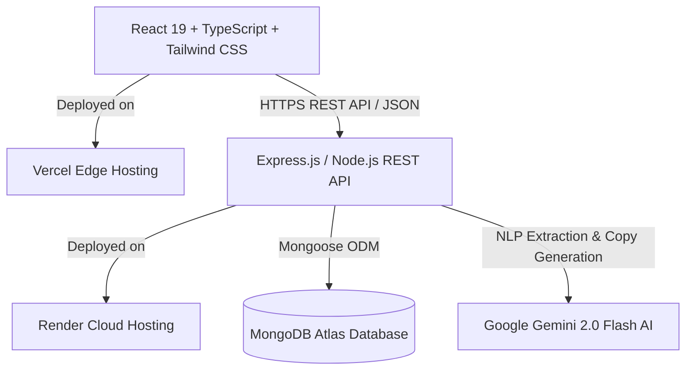

# 🏠 Addis Kiray (ኪራይ አዲስ) — AI-Powered Rental & Real Estate Marketplace

[](https://kiray-addis.vercel.app)
[](https://kirayaddis-1.onrender.com)
[](https://react.dev/)
[](https://www.typescriptlang.org/)
[](https://nodejs.org/)
[](https://www.mongodb.com/)
[](https://ai.google.dev/)

> A full-stack, enterprise-grade rental discovery and property management platform engineered specifically for **Addis Ababa, Ethiopia**. Addis Kiray bridges the gap between prospective tenants and verified landlords through AI-powered conversational search, verified utility data, real-time in-platform messaging, and end-to-end multi-role dashboards.

---

## 🌟 Key Highlights & Problem Solved

Traditional rental hunting in Addis Ababa suffers from fragmented broker networks (*delalas*), misleading listings, hidden deposit terms, and unverified utility assurances (e.g. backup water tanks and generators). **Addis Kiray** solves this by providing:

1. **🤖 Addis AI Search Engine**: Natural language property discovery powered by **Google Gemini 2.0 Flash** that understands sub-city transit corridors (e.g. *Saris, Gotera, Kazanchis, Bole Atlas*) and strictly enforces budget caps.
2. **🛡️ Trust & Verification Tiers**: Multi-level identity verification (Kebele ID, phone SMS OTP, and verified property ownership).
3. **💬 Contextual Real-Time Inquiries**: Direct messaging tied to specific listings with built-in in-person viewing appointment scheduling.
4. **🏢 Complete Multi-Role Portals**: Tailored dashboards for **Tenants**, **Landlords**, and **Super Admins**.

---

## ✨ Features Breakdown

### 1. 🤖 Addis AI Natural Language Matching (`/ai`)
- **Conversational Matching**: Users type natural prompts (e.g. *"I work in Saris, have a 10,000 ETB budget and need a quiet 2-bedroom with backup water tank"*).
- **Corridor & Proximity Heuristics**: Dynamically extracts sub-cities, commute landmarks, and budget constraints.
- **Accurate Match Scoring**: Ranks listings with intelligent multi-factor weighting (budget limits, proximity, utility availability).
- **Contextual Justifications**: Generates human-friendly explanations for why specific properties match user requirements.

### 2. 🔍 Marketplace & Multi-Factor Filter Engine (`/search`)
- Multi-field search across sub-cities (**Bole, Kirkos/Kazanchis, CMC, Yeka, Nifas Silk/Sarbet/Saris, Arada/Piassa, Lideta/Mexico, Gullele**).
- Filter by budget range (e.g. `< 20,000 ETB`, `20k - 45k ETB`, `> 50k ETB`), property types (*Apartment, Condominium, Studio, Villa, House*), and bedrooms.
- Verified utility badges: **Water Tank Reservoir (Liters)**, **Generator**, **24/7 Security**, **Dedicated Parking**, **Balcony**, and **Elevator**.

### 3. 💬 Real-Time Inquiries & Viewing Appointments (`/messages`)
- In-platform chat between tenants and landlords tied directly to properties.
- **Viewing Appointment Workflow**: Tenants request dates/times; landlords receive instant notifications to **Confirm** or **Reschedule**.
- Live database persistence backed by MongoDB Atlas.

### 4. 🏡 End-to-End Landlord Listing Portal (`/landlord/listing`)
- **9-Step Publishing Wizard**:
  - Property information & dynamic area ($m^2$) calculation.
  - Sub-city and landmark transit assignment.
  - **Local Device Photo Uploader** with instant `FileReader` previews + curated high-resolution photo library.
  - Cover photo selection and thumbnail manager.
  - **✦ AI-Assisted Description Generator**: Uses Gemini 2.0 Flash to draft professional property copy in seconds.
  - Dynamic preview and instant publishing directly to MongoDB Atlas.

### 5. 🛡️ Super Admin Operations Console (`/admin`)
- **KPI Analytics**: Real-time counts for active listings, registered users, pending approvals, and trust reports.
- **Moderation Review Queue**: Approve or reject newly submitted landlord properties with custom notes.
- **User Directory**: Search, role filtering, and 1-click verification tier toggle (*Unverified ➔ ID Verified ➔ Property Verified*).
- **Listing Management & Fraud Reports**: Delete inaccurate listings and resolve tenant safety reports.

---

## 🏗️ Architecture & Technology Stack



| Layer | Technologies |
| :--- | :--- |
| **Frontend** | React 19, TypeScript, Vite, Tailwind CSS v4, React Router v8 |
| **Backend** | Node.js, Express.js (ES Modules), TypeScript, Helmet, CORS, Morgan |
| **Database** | MongoDB Atlas Replica Set, Mongoose ODM |
| **AI / NLP** | Google Generative AI SDK (`gemini-2.0-flash`), Regex NLP Corridor Parser |
| **Auth & Security** | JWT (JSON Web Tokens), bcryptjs password hashing, Google OAuth GIS |
| **Cloud & Deployment** | Vercel (Frontend SPA), Render (Backend Web Service) |

---

## 📁 Repository Structure

```
KirayAddis/
├── backend/
│   ├── src/
│   │   ├── config/          # MongoDB Atlas connection with retry logic
│   │   ├── controllers/     # AI, Auth, Properties, Messages, Admin controllers
│   │   ├── middleware/      # JWT auth, role authorization, error handler
│   │   ├── models/          # Mongoose Schemas (User, Property, Message, Viewing, Report)
│   │   ├── routes/          # Express REST API route definitions
│   │   ├── seed.ts          # Comprehensive seed script (28 realistic properties)
│   │   └── server.ts        # Express application bootstrap & CORS setup
│   ├── package.json
│   ├── tsconfig.json
│   └── render.yaml          # Render deployment blueprint
│
├── frontend/
│   ├── src/
│   │   ├── api/             # Normalized API client with auto-prefixing
│   │   ├── components/      # Navbar, Footer, Logo, Icon, UI widgets
│   │   ├── context/         # AuthContext (JWT session & user profile)
│   │   ├── AddisAI.tsx      # AI conversational search interface
│   │   ├── AdminExperience.tsx # Admin operations console
│   │   ├── Homepage.tsx     # Landing page with neighborhood stats & featured homes
│   │   ├── LandlordExperience.tsx # Landlord property manager
│   │   ├── ListingWorkflow.tsx # 9-step listing creation wizard
│   │   ├── MessagingExperience.tsx # Live tenant-landlord chat & viewings
│   │   ├── PropertyDetails.tsx # Detailed view, photo gallery & modals
│   │   ├── SearchResults.tsx # Filterable marketplace search
│   │   └── index.css        # Responsive styling & design tokens
│   ├── vercel.json          # SPA routing rewrite rule
│   ├── package.json
│   └── vite.config.ts
│
└── README.md
```

---

## 🚀 Getting Started (Local Development)

### 1. Prerequisites
- **Node.js**: v18.0 or higher
- **npm**: v9.0 or higher
- **MongoDB Atlas account** (or local MongoDB instance)
- **Google Gemini API Key** ([Google AI Studio](https://aistudio.google.com/))

---

### 2. Clone the Repository
```bash
git clone https://github.com/abdisa38/KirayAddis.git
cd KirayAddis
```

---

### 3. Backend Setup
```bash
cd backend
npm install
```

Create a `.env` file in `/backend`:
```env
PORT=5000
NODE_ENV=development
MONGO_URI=mongodb+srv://<username>:<password>@cluster0.ovb8kel.mongodb.net/addis_kiray?retryWrites=true&w=majority
JWT_SECRET=your_super_secret_jwt_key_here
JWT_EXPIRES_IN=7d
CLIENT_URL=http://localhost:8443,http://localhost:5173
GEMINI_API_KEY=your_google_gemini_api_key
GOOGLE_CLIENT_ID=your_google_oauth_client_id
```

Seed the database with realistic properties across Addis Ababa:
```bash
npm run seed
```

Start the backend development server:
```bash
npm run dev
```
Backend will start at: `http://localhost:5000` (Healthcheck: `http://localhost:5000/api/health`)

---

### 4. Frontend Setup
In a new terminal window:
```bash
cd frontend
npm install
```

Create a `.env` file in `/frontend`:
```env
VITE_API_URL=http://localhost:5000/api
VITE_GOOGLE_CLIENT_ID=your_google_oauth_client_id
```

Start the frontend development server:
```bash
npm run dev
```
Frontend will be accessible at: `http://localhost:8443` (or `http://localhost:5173`)

---

## 🧪 Demo Test Accounts

You can immediately log in and explore the full platform using these pre-seeded accounts:

| Role | Email | Password | Access / Capabilities |
| :--- | :--- | :--- | :--- |
| **Tenant** | `alem@example.com` | `password123` | Search homes, chat with landlords, request viewings, save properties |
| **Landlord** | `kalkidan@example.com` | `password123` | Create listings, manage properties, confirm/decline viewings, answer inquiries |
| **Super Admin** | `admin@addiskiray.com` | `adminpassword123` | Moderate review queue, user directory, toggle verified badges, view KPIs |

---

## 📡 REST API Reference

| Method | Endpoint | Access | Description |
| :--- | :--- | :--- | :--- |
| `GET` | `/api/health` | Public | System status and database connectivity check |
| `POST` | `/api/auth/register` | Public | Create new tenant or landlord account |
| `POST` | `/api/auth/login` | Public | Authenticate user & receive JWT token |
| `POST` | `/api/auth/google` | Public | Authenticate via Google OAuth credential |
| `GET` | `/api/properties` | Public | Fetch properties with multi-field search & filters |
| `GET` | `/api/properties/:id` | Public | Fetch single property details & increment view count |
| `POST` | `/api/properties` | Landlord/Admin | Publish new property listing |
| `GET` | `/api/properties/neighborhoods`| Public | Grouped property counts by sub-city & area |
| `POST` | `/api/ai/match` | Public | AI natural language property search with Gemini |
| `POST` | `/api/ai/generate-description` | Public | Generate professional listing description with AI |
| `GET` | `/api/messages/conversations` | Private | Retrieve active user messaging threads |
| `POST` | `/api/messages/conversations` | Private | Start inquiry thread for a property |
| `POST` | `/api/messages/viewings` | Private | Schedule in-person property viewing appointment |
| `PATCH`| `/api/messages/viewings/:id/status` | Private | Confirm, reschedule, or cancel viewing |
| `GET` | `/api/admin/kpis` | Admin | Fetch system analytics & marketplace counts |
| `GET` | `/api/admin/queue` | Admin | Fetch pending properties awaiting moderation |
| `PATCH`| `/api/admin/properties/:id/moderate`| Admin | Approve or reject listing |
| `GET` | `/api/admin/users` | Admin | List all registered tenants and landlords |

---

## 🌐 Production Deployment

- **Frontend on Vercel**:
  - Root Directory: `frontend`
  - Build Command: `npm run build`
  - Output Directory: `dist`
  - Environment Variables: `VITE_API_URL=https://kirayaddis-1.onrender.com/api`
  - Handled by [`frontend/vercel.json`](./frontend/vercel.json) for client-side routing.
- **Backend on Render**:
  - Root Directory: `backend`
  - Build Command: `npm install && npm run build`
  - Start Command: `npm run start`
  - Configured via [`backend/render.yaml`](./backend/render.yaml).

---

## 👨‍💻 Author & Contributions

- **Developer**: Abdisa Awel
- **Portfolio**: [abdisa.pro.et](https://abdisa.pro.et)
- **GitHub**: [@abdisa38](https://github.com/abdisa38)
- **Repository**: [https://github.com/abdisa38/KirayAddis](https://github.com/abdisa38/KirayAddis)

---

## 📄 License
This project is licensed under the [ISC License](LICENSE).
